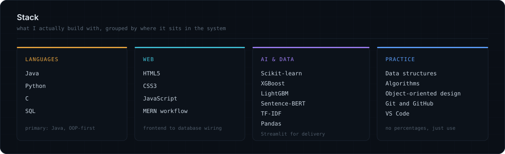
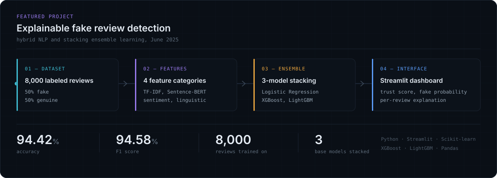
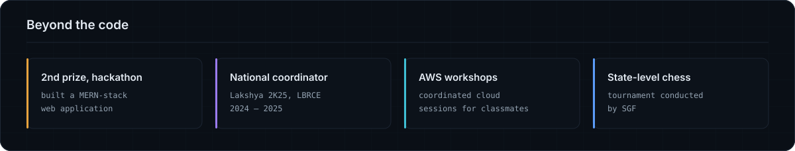
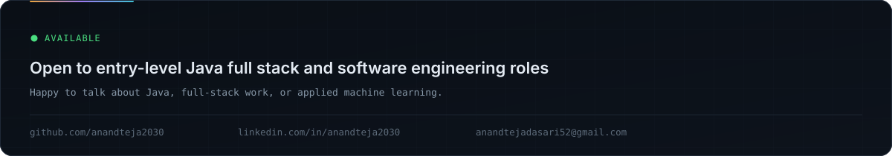

 

&nbsp;

&nbsp;

 

## Developer Profile

> **AI & Data Science undergraduate** with a **Java Full Stack Developer** direction. I build with Java fundamentals, web technologies and applied machine learning, and I am targeting an **entry-level** role.

<table width="100%">
  <tr>
    <td width="50%" valign="top">
      <strong>☕ Java Foundations</strong> 
      Java · Object-Oriented Programming · Data Structures & Algorithms · SQL
    </td>
    <td width="50%" valign="top">
      <strong>🌐 Web Development</strong> 
      HTML5 · CSS3 · JavaScript · 2nd Prize in a hackathon for a MERN-stack web application
    </td>
  </tr>
  <tr>
    <td valign="top">
      <strong>🧠 Applied AI</strong> 
      Python ML pipelines · NLP feature engineering · stacking ensembles
    </td>
    <td valign="top">
      <strong>⚙️ Working Style</strong> 
      Project-driven learning · measurable results · Git-based collaboration
    </td>
  </tr>
</table>

 

## Technical System

 

## Project Lab

### Explainable Fake Review Detection · June 2025

`Dataset` → `Features` → `Stacking Ensemble` → `Explainable Dashboard`

<table width="100%">
  <tr>
    <td align="center" width="25%"><h3>94.42%</h3>ACCURACY</td>
    <td align="center" width="25%"><h3>94.58%</h3>F1 SCORE</td>
    <td align="center" width="25%"><h3>8,000</h3>REVIEWS</td>
    <td align="center" width="25%"><h3>3</h3>STACKED MODELS</td>
  </tr>
</table>

**Hybrid NLP & Stacking Ensemble Learning**

- **Dataset** — Balanced set of **8,000 reviews**: **50% fake** · **50% genuine**
- **Features** — 4 categories: `TF-IDF` · `Sentence-BERT embeddings` · `Sentiment analysis` · `Handcrafted linguistic attributes`
- **Model** — Stacking ensemble of `Logistic Regression` + `XGBoost` + `LightGBM`
- **Results** — **94.42% accuracy** · **94.58% F1 score**
- **Dashboard** — Streamlit interface with **trust scores**, **fake-review probability**, **explainable predictions** and **visual analytics**

`Python` `Streamlit` `Scikit-learn` `XGBoost` `LightGBM` `Sentence-BERT` `TF-IDF` `Pandas`

 

### Interactive Sorting Algorithm Visualizer · September 2025

An interactive browser app that turns **sorting algorithms into animated, step-by-step visuals**, with real-time **comparison** and **swap** display.

| ⚙️ 5 Algorithms | 🎛️ 4 Interactive Controls |
| :-- | :-- |
| `Bubble Sort` | **1.** Custom array input |
| `Selection Sort` | **2.** Random array generation |
| `Insertion Sort` | **3.** Adjustable animation speed |
| `Merge Sort` | **4.** Performance statistics |
| `Quick Sort` | |

**Built to demonstrate:** algorithm logic · JavaScript-driven animation · interactive UI · responsive **CSS3** layout

`HTML5` `CSS3` `JavaScript`

 

## Engineering Experience

<table width="100%">
  <tr>
    <td>
      <h3>AI Intern — Mindenious</h3>
      <code>Jun 2025 – Jul 2025</code>  
      <code>Python</code> <code>Machine Learning</code> <code>EDA</code> <code>Git</code>  
      ▸ Applied Python-based ML methods for <strong>data preprocessing</strong> and <strong>predictive modeling</strong> 
      ▸ Evaluated ML algorithms for data analysis and prediction tasks 
      ▸ Ran <strong>exploratory data analysis</strong> to identify patterns and derive insights 
      ▸ <strong>Debugged and optimized</strong> assigned project modules, completing tasks within deadlines 
      ▸ Collaborated on project structure and <strong>version control using Git</strong>
    </td>
  </tr>
</table>

<table width="100%">
  <tr>
    <td>
      <h3>MERN Stack Intern — CSC India (APSCHE)</h3>
      <code>May 2026 – Jun 2026</code>  
      <code>HTML</code> <code>CSS</code> <code>JavaScript</code>  
      ▸ Learned and practiced <strong>HTML</strong> for structuring web pages 
      ▸ Learned and practiced <strong>CSS</strong> for styling and layout 
      ▸ Learned and practiced <strong>JavaScript</strong> for web page behavior
    </td>
  </tr>
</table>

 

## Education & Certifications

<table width="100%">
  <tr>
    <td width="72%" valign="middle">
      <h3>B.Tech · Artificial Intelligence and Data Science</h3>
      Lakireddy Bali Reddy College of Engineering (LBRCE) 
      <code>2023 – 2027</code>
    </td>
    <td width="28%" align="center" valign="middle">
      <h2>8.87 / 10</h2>
      CGPA
    </td>
  </tr>
</table>

<table width="100%">
  <tr>
    <td width="50%" valign="top">
      <strong>Intermediate</strong> · <code>85%</code> 
      Andhra Loyola College · 2021 – 2023
    </td>
    <td width="50%" valign="top">
      <strong>SSC</strong> · <code>83%</code> 
      Z.P.H.S, Podu · 2020 – 2021
    </td>
  </tr>
</table>

### Certifications

<table width="100%">
  <tr>
    <td width="25%" valign="top" align="center">
      <strong>☁️ Cloud</strong>  
      AWS Certified Cloud Practitioner 
      <code>Oct 2025</code>
    </td>
    <td width="25%" valign="top" align="center">
      <strong>☕ Java</strong>  
      HackerRank Java (Basic) 
      <code>Aug 2025</code>  
      Infosys Java: Essentials 
      <code>Mar 2026</code>
    </td>
    <td width="25%" valign="top" align="center">
      <strong>🐍 Python</strong>  
      Cisco Python Essentials 1 
      <code>Mar 2025</code>
    </td>
    <td width="25%" valign="top" align="center">
      <strong>🎨 Front End</strong>  
      Complete Front End Development Journey 
      <code>Mar 2025</code>
    </td>
  </tr>
</table>

 

## Milestones

 

## GitHub Telemetry

 

 

&nbsp;

&nbsp;

